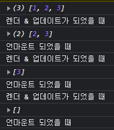

# Hook

그 동안 클래스에서 props와 state를 위해서 this를 붙혀주고 constructor를 만들어주는 등 여러가지의 노력(?)을 하였습니다.

이제 Hook이 나옴으로써 우리는 클래스에 대한 의존도를 약간이나마 벗어날 수 있게 되었습니다.

Hook은 리액트의 16.8버전부터 나왔으며 당시에는 리액트를 쓰던 사람들이 쌍수를 들고 환영했습니다.

그 이유를 알아 볼까요?

1. 더 이상 클래스 컴포넌트를 무조건 만들 필요가 없어졌다.
2. state를 쓰는데에 있어서 엄청 큰 편리함이 생겼다.
3. 생명주기를 쓰는데에 있어 클래스 컴포넌트에서 사용할 일이 없어졌다.

즉 Hook은 그 동안에 자바스크립트에 자신이 있다라고 생각하던 사람들도 Class라는 것에 친숙하지 못하여 헤메는 등의 모습에서 다시 함수형 컴포넌트로 돌아와 자바스크립트에 대해서 큰 이해를 하지 못하더라도 리액트를 구현 할 수 있게 되었다는 점에서 큰 환영을 받았습니다.

하지만 그렇다고 모든 컴포넌트를 Function으로 구현하지는 않습니다.

예를들어 함수가 많거나 큰 틀에서 사용할 컴포넌트는 여전히 Class를 이용하고 내부에 들어가는 세세한 것들에 대해서는 Function을 사용하는 등 자신만의 기준으로 함수와 클래스를 왔다갔다 합니다.

심지어 기존에 Class로 구현된 코드들은 잘 동작하고 있기 때문에 굳이 함수형 컴포넌트로 변경 할 필요가 없습니다. (심지어 클래스 컴포넌트는 지속적으로 제공 할 것이라고 리액트에서 공식적으로 선언 하였습니다.)

## useState

useState의 기본형은 다음과 같습니다.

```javascript
const [state값, 값을 수정하는 함수 명] = useState(초기값);
```

useState는 기존에 Class에서 사용하던 this.state와 setState를 대체하는 함수 사용입니다.


useState함수에 파라미터로 기본값을 전달하고 사용할 state의 이름과 setState의 이름을 커스터마이징 할 수 있다는 점이 큰 특징입니다.

useState를 하기 전에 Class형으로 버튼을 클릭 했을 때 counter가 증가하여 이를 화면에 렌더링 하는 코드를 구현 해 보겠습니다.

> hook-before.html

```javascript
<!DOCTYPE html>
<html lang="en">
  <body>
    <div id="root"></div>
  </body>
  <script
    crossorigin
    src="https://unpkg.com/react@18/umd/react.development.js"
  ></script>
  <script
    crossorigin
    src="https://unpkg.com/react-dom@18/umd/react-dom.development.js"
  ></script>
  <script src="https://unpkg.com/@babel/standalone/babel.min.js"></script>
  <script type="text/babel">
    const root = document.getElementById("root");
    class App extends React.Component {
      constructor(props) {
        super(props);
        this.state = {
          counter: 0,
        };
      }

      add = () => {
        this.setState({ counter: this.state.counter + 1 });
      };

      render() {
        return (
          <div>
            <span>클릭: {this.state.counter}</span>
            <button style={{ color: "red" }} onClick={this.add}>
              클릭
            </button>
          </div>
        );
      }
    }

    ReactDOM.render(<App />, root);
  </script>
</html>
```

위의 코드는 어디서 많이 구현해 본 것 같지 않은가요?

우리는 이미 Hook을 사용 해 보았었습니다. 언제 사용했었냐면 4. State에서 간단하게 `useState()`를 이용해서 state값을 변경 해 보았었습니다. 클래서 컴포넌트에서 훅을 사용해 함수 컴포넌트로 바꾸어 보면서 그 때의 기억을 떠올려 봅시다.

> hook-state.html

```javascript
<!DOCTYPE html>
<html lang="en">
  <body>
    <div id="root"></div>
  </body>
  <script
    crossorigin
    src="https://unpkg.com/react@18/umd/react.development.js"
  ></script>
  <script
    crossorigin
    src="https://unpkg.com/react-dom@18/umd/react-dom.development.js"
  ></script>
  <script src="https://unpkg.com/@babel/standalone/babel.min.js"></script>
  <script type="text/babel">
    const root = document.getElementById("root");
    const App = () => {
      const data = React.useState(0);
      console.log(data);
      const [counter, change] = data;
      function add() {
        change((current) => current + 1);
      }
      return (
        <div>
          <span>클릭: {counter}</span>
          <button style={{ color: "red" }} onClick={add}>
            클릭
          </button>
        </div>
      );
    };

    ReactDOM.render(<App />, root);
  </script>
</html>
```

이제 예시에서 사용한 useState가 무엇인지 살짝 기억이 났습니다. 그러나 어떻게 사용했는지 기억이 나지 않기 때문에 다시 복습을 해 봅시다.

`const data = React.useState(0)`을 `console.log(data)`를 찍어보면 [undefined, ƒ]가 나왔습니다. 첫 번째에 있는 값이 초기값이고 두번째가 첫번째 값을 변경한다고 하였습니다.

만약 state를 2개 이상 사용해야할 필요가 있을 때에는 useState를 따로 호출하게 되면 State를 호출 할 수 있습니다.

아래의 예시는 State를 두개 사용한 예시입니다.

> hook-state.html

```javascript
<!DOCTYPE html>
<html lang="en">
  <body>
    <div id="root"></div>
  </body>
  <script
    crossorigin
    src="https://unpkg.com/react@18/umd/react.development.js"
  ></script>
  <script
    crossorigin
    src="https://unpkg.com/react-dom@18/umd/react-dom.development.js"
  ></script>
  <script src="https://unpkg.com/@babel/standalone/babel.min.js"></script>
  <script type="text/babel">
    const root = document.getElementById("root");
    const App = () => {
      const data = React.useState(0);
      console.log(data);
      const [counter, change] = data;
      function add() {
        change((current) => current + 1);
      }
      const [counter2, change2] = React.useState(1);
      function add2() {
        change2((current) => current2 + 1);
      }
      return (
        <div>
          <span>클릭: {counter}</span>
          <button style={{ color: "red" }} onClick={add}>
            클릭
          </button>
        </div>
      );
    };

    ReactDOM.render(<App />, root);
  </script>
</html>
```

이제 우리가 mapAndKey에서 리스트로 출력 했던 부분의 Class를 함수 컴포넌트로 바꾸어 보려고 합니다. 기존 list.html을 복사 해서 새로운 hook-list.html을 만들어 보고 안의 코드를 넣어 봅시다.

기존 코드의 ListControl 클래스는 아래와 같습니다.

> hook-list.html

```javascript
class ListControl extends React.Component {
  constructor(props) {
    super(props);
    this.state = {
      list: [1, 2, 3],
      value: "",
    };
  }

  handleChange = (e) => {
    this.setState({ value: e.target.value });
  };

  handleInsert = () => {
    this.setState({
      list: [...this.state.list, this.state.value],
      value: "",
    });
  };

  handleRemove = (index) => {
    const lists = this.state.list;
    this.setState({
      list: [...lists.slice(0, index), ...lists.slice(index + 1, lists.length)],
    });
  };

  render() {
    return (
      <React.Fragment>
        <AddArea
          value={this.state.value}
          onChange={this.handleChange}
          onClick={this.handleInsert}
        />
        <TextLists items={this.state.list} onDoubleClick={this.handleRemove} />
      </React.Fragment>
    );
  }
}
```

위의 코드를 함수형으로 바꾼 코드는 다음과 같습니다.

```javascript
function ListControl(props) {
  const [list, chnageList] = React.useState([1, 2, 3]);
  const [value, chnageValue] = React.useState("");

  const handleChange = (e) => {
    chnageValue(e.target.value);
  };

  const handleInsert = () => {
    chnageList([...list, value]);
  };

  const handleRemove = (index) => {
    const lists = list;
    chnageList([
      ...lists.slice(0, index),
      ...lists.slice(index + 1, lists.length),
    ]);
  };

  return (
    <React.Fragment>
      <AddArea value={value} onChange={handleChange} onClick={handleInsert} />
      <TextLists items={list} onDoubleClick={handleRemove} />
    </React.Fragment>
  );
}

root.render(<ListControl />);
```

JSX는 기존과 그대로 사용하면 되지만 Class에서 써야했던 constructor, this가 들어가는 부분들이 없어지면서 한결 코드가 깔끔 해 졌습니다.

## useEffect

useEffect는 기본형은 다음과 같습니다.

```javascript
useEffect(() => {
  console.log("렌더 & 업데이트가 되었을 때");

  return function 함수명() {
    console.log("언마운트 되었을 때");
  };
});
```

useEffect는 기존의 생명주기를 함수형으로 대체한 하기 위해 기능이 나왔지만 기존의 생명주기와는 완벽하게는 같지 않습니다.

기존의 생명주기와의 차이점으로는 다음과 같습니다.

1. 하나의 함수에서 componentDidMount, componentDidUpdate, componentDidUnmount 세 가지 생명주기를 모두 컨트롤 합니다.
2. 기존의 생명주기와 동작하는 타이밍이 다릅니다.
3. 기존의 생명주기가 필요할 때에는 Class형으로 코딩 할 필요가 있습니다.

우선 기존의 생명주기를 한번 작성 해 봅시다.

> hook-effect.html

```javascript
<!DOCTYPE html>
<html lang="en">
  <body>
    <div id="root"></div>
  </body>
  <script
    crossorigin
    src="https://unpkg.com/react@18/umd/react.development.js"
  ></script>
  <script
    crossorigin
    src="https://unpkg.com/react-dom@18/umd/react-dom.development.js"
  ></script>
  <script src="https://unpkg.com/@babel/standalone/babel.min.js"></script>
  <script type="text/babel">
    const root = ReactDOM.createRoot(document.getElementById("root"));

    function ListItem(props) {
      return <li onDoubleClick={props.onDoubleClick}>{props.value}</li>;
    }

    class AddArea extends React.Component {
      constructor(props) {
        super(props);
      }

      componentDidMount() {
        console.log("렌더가 되었을 때");
      }

      componentDidUpdate() {
        console.log("업데이트가 되었을 때");
      }

      componentWillUnmount() {
        console.log("언마운트 되었을 때");
      }

      render() {
        return (
          <div>
            <input value={this.props.value} onChange={this.props.onChange} />
            <button onClick={this.props.onClick}>추가</button>
          </div>
        );
      }
    }

    function TextLists(props) {
      const items = props.items;
      return (
        <ul>
          {items.map((value, index) => {
            return (
              <ListItem
                key={index}
                value={value}
                onDoubleClick={() => {
                  props.onDoubleClick(index);
                }}
              >
                {value}
              </ListItem>
            );
          })}
        </ul>
      );
    }

    class ListControl extends React.Component {
      constructor(props) {
        super(props);
        this.state = {
          list: [1, 2, 3],
          value: "",
        };
      }

      handleChange = (e) => {
        this.setState({ value: e.target.value });
      };

      handleInsert = () => {
        this.setState({
          // list: this.state.list.concat(this.state.value),
          list: [...this.state.list, this.state.value],
          value: "",
        });
      };

      handleRemove = (index) => {
        const lists = this.state.list;
        this.setState({
          list: [
            ...lists.slice(0, index),
            ...lists.slice(index + 1, lists.length),
          ],
        });
      };

      render() {
        console.log(this.state.list);
        if (this.state.list.length === 0) {
          console.log();
        }
        return (
          <React.Fragment>
            {this.state.list.length !== 0 && (
              <AddArea
                value={this.state.value}
                onChange={this.handleChange}
                onClick={this.handleInsert}
              />
            )}
            <TextLists
              items={this.state.list}
              onDoubleClick={this.handleRemove}
            />
          </React.Fragment>
        );
      }
    }

    root.render(<ListControl />);
  </script>
</html>

```

기존의 코드와이 차이점으로는 ListControl 컴포넌트의 return 부분의 JSX에서 &&연산자를 통해서 조건부 렌더링을 진행했다는 점이 기존 코드와의 차이점인것을 인지하고 해당 페이지에서 모든 리스트를 삭제 해 봅시다.


최초 화면에 출력이 되었을 때에는 렌더가 되었을 때가 나옵니다. 그리고 하나씩 리스트를 삭제하면 업데이트가 되었다고 나오고, 마지막으로 state의 list가 전부 삭제되어 AddArea 컴포넌트가 더이상 렌더링이 되지 않았을 때 언마운트가 되었다는 이벤트가 동작하게 됩니다.

즉 이벤트의 순서는 다음과 같습니다.

1. componentDidMount() : 최초 마운트 되었을 때
2. componentDidUpdate() : 값이 업데이트 되었을 때
3. componentWillUnmount() : 컴포넌트가 렌더링 안되었을 때

이제 class로 구현한 생명주기를 함수형으로 바꾸어 봅시다. 위의 hook-effect.html 코드에서 클래스로 구현한 AddArea를 아래처럼 함수로 변경 해 봅시다.

> hook-effect.html

```javascript
function AddArea(props) {
  React.useEffect(() => {
    console.log("렌더 & 업데이트가 되었을 때");

    return function funcName() {
      console.log("언마운트 되었을 때");
    };
  });

  return (
    <div>
      <input value={props.value} onChange={props.onChange} />
      <button onClick={props.onClick}>추가</button>
    </div>
  );
}
```

테스트에 들어가기 전에 기존의 클래스형과 다른점이 하나 있습니다. 렌더와 업데이트가 되었을 때 하나의 코드로 구현이 됩니다! 즉 렌더링과 업데이트의 코드가 동일하게 동작이 됩니다.

그리고 우리가 웹에서 리스트를 하나 삭제 해 봅시다.



저희가 기존에 클래스에서 진행하던 언마운트와 타이밍이 다른것 같습니다!

함수형으로 사용되는 생명주기인 useEffect는 컴포넌트의 생명주기에 초점을 맞추기 보다 해당 함수가 동작하는 생명주기에 초점을 맞추었기 때문에 다릅니다.

예를들어 함수가 동작하고 새롭게 호출이 되었을 때에는 기존 함수와 연결을 끊고 새로운 함수를 호출하여 실행을 한다는 개념에 가깝고, 클래스의 경우에는 기존 클래스 내부에서 계속 동작한다는 개념이 강합니다.


함수를 사용한다는 것은 조금 더 도구적인 느낌에 가깝고 클래스는 전체 작업 자체를 사용한다는 느낌에 가깝습니다.

그래서 생명주기를 사용 할 때 물론 언마운트가 되는 동작을 하지 않도록 IF문으로 리소스를 절약하는 방법이 있습니다.

그렇다면 언제 useEffect를 쓰고, 언제 Class 생명주기를 써야하는지 감을 잡기 위해 하나의 예제를 진행 해 보려고 합니다.

아래의 예제는 렌더링이 된 이후에 1초마다 "Tick"이라는 문자열을 콘솔에 띄워 봅시다.

우선은 기존에 구현했던 hook-effect.html에서 주석했던 클래스형에서 1초마다 "Tick"를 반복하는 코드를 구현 해 봅시다.

> hook-effect.html

```javascript
class ListControl extends React.Component {
      constructor(props) {
        super(props);
        this.state = {
          list: [1, 2, 3],
          value: "",
        };
      }
  let id;

      componentDidMount() {
        id = setInterval(() => {
          console.log(`tick ${this.value}`);
        }, 1000);
      }

      componentDidUpdate() {
        clearInterval(id);
        id = setInterval(() => {
          console.log(`tick ${value}`);
        }, 1000);
      }

      componentWillUnmount() {
        clearInterval(id);
      }

      handleChange = (e) => {
        this.setState({ value: e.target.value });
      };

      handleInsert = () => {
        this.setState({
          // list: this.state.list.concat(this.state.value),
          list: [...this.state.list, this.state.value],
          value: "",
        });
      };

      handleRemove = (index) => {
        const lists = this.state.list;
        this.setState({
          list: [
            ...lists.slice(0, index),
            ...lists.slice(index + 1, lists.length),
          ],
        });
      };

      render() {
        console.log(this.state.list);
        if (this.state.list.length === 0) {
          console.log();
        }
        return (
          <React.Fragment>
            {this.state.list.length !== 0 && (
              <AddArea
                value={this.state.value}
                onChange={this.handleChange}
                onClick={this.handleInsert}
              />
            )}
            <TextLists
              items={this.state.list}
              onDoubleClick={this.handleRemove}
            />
          </React.Fragment>
        );
      }
    }
```

위의 코드처럼 최초 페이지가 렌더링 되었을 때 tick이라는 setTimeout을 걸어주는데, componentDidMount에서 선언했던 변수는 componentDidUpdate에서 사용할 수 없기 때문에 한단계 위에서 변수를 선언하고 해당 함수에서 setInterval을 설정 해 주는 것이 보입니다.

그리고 Update단계에서 clearInterval을 해 주고, 다시 걸어줍니다.

만약 그렇지 않으면 tick이 중복되어 돌 것 입니다.

정말 중복이 되는지 테스트 해 보기 위해 input에 아무 텍스느 하나를 입력 해 봅시다.

이제 tick 이벤트가 중복이 되는 것을 볼 수 있습니다.

그러므로 불필요하게 id를 한단계위로 빼 주고, update에서 기존 setInterval을 clear시켜준 뒤 새로 걸어주는 방식으로 생명주기를 유지 해야 합니다.

이제 componentDidUpdate에 clearInterval을 넣고 모든 리스트를 삭제하면 componentUnMount가 되어 setInterval이 동작하지 않는 것을 볼 수 있습니다.

자 그렇다면 위의 클래스를 함수로 가서 작업 해 봅시다.

코드는 다음과 같습니다.

> hook-effect.html

```javascript
function ListControl(props) {
  const [list, chnageList] = React.useState([1, 2, 3]);
  const [value, chnageValue] = React.useState("");

  React.useEffect(() => {
    const id = setInterval(() => {
      console.log(`tick ${value}`);
    }, 1000);

    return function clear() {
      clearInterval(id);
    };
  }, [value]);

  const handleChange = (e) => {
    chnageValue(e.target.value);
  };

  const handleInsert = () => {
    chnageList([...list, value]);
    chnageValue("");
  };

  const handleRemove = (index) => {
    const lists = list;
    chnageList([
      ...lists.slice(0, index),
      ...lists.slice(index + 1, lists.length),
    ]);
  };

  return (
    <React.Fragment>
      <AddArea value={value} onChange={handleChange} onClick={handleInsert} />
      <TextLists items={list} onDoubleClick={handleRemove} />
    </React.Fragment>
  );
}
```

기존의 클래스 컴포넌트에서 사용했던 생명주기보다 훨씬 간결하고 변수도 함수 내부에서 사용 할 수 있기 때문에 별도의 한 단계 위나 전역에서 사용 할 필요가 없어졌습니다.

즉 클래스형에서는 한 페이지 전체를 관리 할 때 생명주기를 사용해야되고, 해당 생명주기가 하위 컴포넌트로 전파가 될 때에 사용 합니다.

함수형 컴포넌트는 각각의 요소요소에서 다른 컴포넌트와의 연관성이 떨어질 때 함수형으로 useEffect를 사용 해 준다면 훨씬 효율적으로 사용 할 수 있습니다.

## useRef

useRef 기본형은 다음과 같습니다.

```javascript
const 변수 명 = React.useRef(전달된 인자);
```

ref를 쓸 때에는 다음과 같습니다.

1. 포커스, 텍스트 선택영역, 혹은 미디어의 재생을 관리할 때.
2. 애니메이션을 직접적으로 실행시킬 때.
3. 서드 파티 DOM 라이브러리를 React와 같이 사용할 때.

컴포넌트에서 특정 DOM을 선택 해야 할 때 ref를 사용 합니다. 우리가 html에서 특정 Element에 대한 정보를 가지고 올 때 아래와 같이 합니다.

우선 useRef에 대해서 간단한 예를 사용하기 위해 이전의 hook-effect.html에서 코드를 가지고 와 AddArea의 코드를 아래와 같이 수정 해 봅시다.

> hook-ref.html

```javascript
function AddArea(props) {
  const input = React.useRef(null);

  const onButtonClick = () => {
    input.current.value = "";
  };
  console.log(input);
  return (
    <div>
      <input ref={input} value={props.value} onChange={props.onChange} />
      <button onClick={props.onClick}>추가</button>
      <button onClick={onButtonClick}>초기화</button>
    </div>
  );
}
```

input을 console에 찍었을 때 input의 값은 객체의 형태이고 안에는 current로 input이 들어가 있는 것을 알 수 있습니다. 그리고 current에는 우리가 document.getElementId()를 했을 때 받아오는 데이터에 리액트의 데이터가 같이 있는 것을 볼 수 있습니다.

useRef는 가능한 사용하는 컴포넌트에서 사용을 하며 간혹 부모에서 자식으로 props로 ref를 넘기고 싶을 때에는 forwardRef()를 이용하여 형태를 정의하고 넘겨 주어야 합니다. 하지만 이는 모듈식으로 React를 구성할 때에 부모에서 자식으로 넘겨주는 것은 추천되지 않습니다.

## useMemo

useMemo 기본형은 다음과 같습니다.

```javascript
const 변수 명 = useMemo(() => 계산하는 함수(a, b), [a, b]);
// 여기서 a와b는 특정 변수
```

useMemo는 useState와 더불어 많이 사용이 됩니다. 그 이유는 특정 값이 바뀔 때만 Memo에 있는 함수를 이용하여 값을 바꾸어 주기 때문에 페이지 전체가 리렌더링이 되는 것을 막을 수 있기 때문입니다.

우리는 현재 리스트의 개수를 출력하는 div를 하나 만들어 보려고 합니다.

예제는 아래와 같습니다.

> hook-memo.html

```html
<!DOCTYPE html>
<html lang="en">
  <body>
    <div id="root"></div>
  </body>
  <script
    crossorigin
    src="https://unpkg.com/react@18/umd/react.development.js"
  ></script>
  <script
    crossorigin
    src="https://unpkg.com/react-dom@18/umd/react-dom.development.js"
  ></script>
  <script src="https://unpkg.com/@babel/standalone/babel.min.js"></script>
  <script type="text/babel">
    const root = ReactDOM.createRoot(document.getElementById("root"));

    function AddArea(props) {
      const input = React.useRef(null);

      const onButtonClick = () => {
        input.current.value = "";
      };
      console.log(input);
      return (
        <div>
          <input ref={input} value={props.value} onChange={props.onChange} />
          <button onClick={props.onClick}>추가</button>
          <button onClick={onButtonClick}>초기화</button>
        </div>
      );
    }

    function ListItem(props) {
      return <li onDoubleClick={props.onDoubleClick}>{props.value}</li>;
    }

    function TextLists(props) {
      const items = props.items;
      return (
        <ul>
          {items.map((value, index) => {
            return (
              <li
                key={index}
                onDoubleClick={() => {
                  props.onDoubleClick(index);
                }}
              >
                {value}
              </li>
            );
          })}
        </ul>
      );
    }

    function TextArea(props) {
      return (
        <div>
          <span>{`현재 리스트의 개수는 ${props.len}개 입니다.`}</span>
        </div>
      );
    }

    function ListControl(props) {
      const [list, chnageList] = React.useState([1, 2, 3]);
      const [value, changeValue] = React.useState("");

      const checkListLen = () => {
        console.log("checkListLen 실행");
        return list.length;
      };

      const handleChange = (e) => {
        changeValue(e.target.value);
      };

      const handleInsert = () => {
        chnageList([...list, value]);
        changeValue("");
      };

      const handleRemove = (index) => {
        const lists = list;
        chnageList([
          ...lists.slice(0, index),
          ...lists.slice(index + 1, lists.length),
        ]);
      };

      return (
        <React.Fragment>
          <AddArea
            value={value}
            onChange={handleChange}
            onClick={handleInsert}
          />
          <TextArea len={checkListLen()} />
          <TextLists items={list} onDoubleClick={handleRemove} />
        </React.Fragment>
      );
    }

    root.render(<ListControl />);
  </script>
</html>
```

카운트의 숫자를 반영 할 수 있는 TextArea를 선언하고 ListControl에 카운트를 list.length로 넘겨도 괜찮지만 추후 특성에 따라 숫자를 넘길 수 있다고 가젇하고 함수를 하나 만들어 봅시다. 함수 명은 checkListLen이며 list.length를 반환합니다.

이제 input값에 아무 값을 입력 해 봅시다.

우리는 AddArea의 input값을 변경하였는데도 checkListLen이 동작하여 개수를 다시 계산하고 이를 렌더링 하고 있습니다. 이것이 하나 둘 쌓이게 되면 리액트의 효율이 떨어집니다.

그러므로 우리는 useMemo를 통해서 특정 값이 바뀌었을 때 해당 연산(함수)가 실행이 되도록 코드를 변경 해 봅시다.

코드는 아래와 같습니다.

```javascript
const len = React.useMemo(() => checkListLen(), [list]);
```

useMemo를 한 뒤 callback함수 형식으로 선언 해 주고 끝에는 특정 값에 변동이 있을 때 계산을 다시 해서 값을 반영하는 것이 가능 해 졌습니다!

## useCallback

useCallback의 기본형은 다음과 같습니다.

```javascript
const memoizedCallback = useCallback(() => {
  doSomething(a, b);
}, [a, b]);
```

useCallback은 콜백의 useMemo를 반환합 니다.

useCallback(fn, deps)은 useMemo(() => fn, deps)같으므로 useCallback이 있다~ 정도만 참고 해 주셔도 괜찮습니다.
